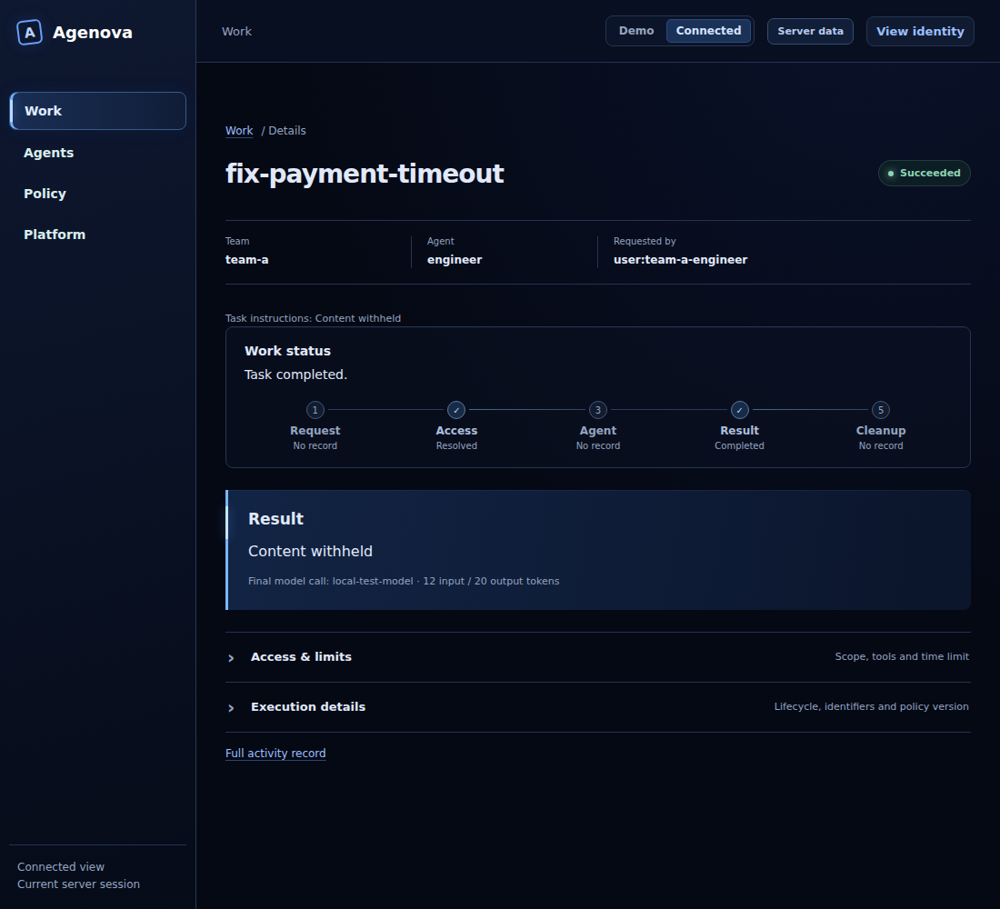
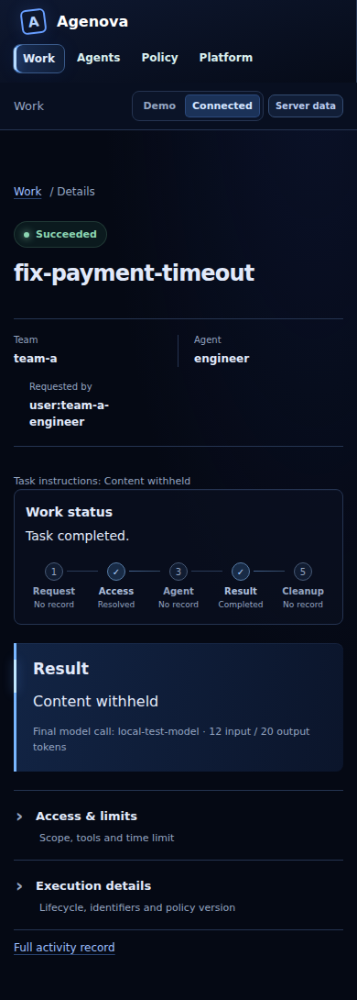

# E17 PostgreSQL Core and Public Privacy Evidence

Task: [#179](https://github.com/wunderforge/agenova/issues/179). Active packet:
[scoped Memory](../../../work/0179-scoped-memory/task.md). This continuation
builds on commit `533b99ee83779b2c932a556300ecc5548a91d66b` in draft
[PR #212](https://github.com/wunderforge/agenova/pull/212). E17 is not complete.

## Implemented Boundary

- PostgreSQL SQL adapter consumes a trusted host-owned `database/sql.DB`.
  No driver, DSN lookup, credential resolver, migration runner or installation
  fallback is added. Startup checks schema version, non-administrative role,
  forced RLS, owner separation and table/schema permissions.
- Apply-once version-one schema separates append-only records and invocation
  receipts with namespace-scoped keys, default-deny SELECT/INSERT RLS and no
  application update/delete policies. An operator owns schema/role setup.
- Write binds parameters, sets ownership transaction-locally, serializes a
  namespace/invocation receipt and commits record/receipt together. Matching
  receipts return the known committed record without another write; different
  content fails. Unknown COMMIT acknowledgement returns WriteUncertain with no
  retry. Search is literal, parameterized, bounded and read-only.
- Memory-requesting public views, including denied and scope-only requests,
  replace task input with `{}`, omit outcome text and mark both redaction paths.
  The canonical submission format and private execution data are unchanged.
  This is content projection, not a general PII detector or replay format.
- HTTP submission/query/Claim/list, reference submission and CLI outputs share
  the projection. Go/Portal readers reject missing, unknown or duplicate paths,
  missing empty input and hidden content. Ordinary non-Memory Work retains text.
- Portal shows fixed withheld-content labels. Memory invocation readers remain
  deliberately disabled pending their complete correlation/integration slice;
  this does not claim live Memory activity presentation.

## Reproduction and Gates

Use the repository's declared dependencies plus a race-capable C toolchain and
Playwright browser prerequisites. This run used WSL Ubuntu 24.04, Go 1.27.1,
Node 24.12.0, PowerShell 7.6.6, GCC 13.3 and Playwright 1.63.0/Chromium 153.
Tool setup is workspace-local except the already documented WSL C toolchain;
repository dependency locks and its Go requirement are unchanged.

| Gate | Command / artifact | Result |
| --- | --- | --- |
| Adapter focused and race | `go test -v -count=1 ./internal/memory/postgres ./internal/memory`; `go test -race -count=1 ./internal/memory/postgres ./internal/memory` | pass |
| Adapter repository gate | `pwsh -NoProfile -File ./scripts/check.ps1 -All`; [captured output](../../../work/0179-scoped-memory/slice2-adapter-linux.log) | pass, 125 frontend tests / 52 browser cases |
| Final focused privacy / adapter | `go test -v -count=1 ./internal/evidence ./internal/console ./internal/connectedclient ./internal/cli ./internal/app ./internal/memory/...` | pass |
| Final race | same packages with `go test -race -count=1` | pass |
| Focused rendered privacy | `npm run test:smoke -- --grep 'Memory projection'` in `ui`; [output](../../../work/0179-scoped-memory/slice2-privacy-browser.log) | pass, 2 browser cases |
| Final repository gate | `pwsh -NoProfile -File ./scripts/check.ps1 -All`; [output](../../../work/0179-scoped-memory/slice2-final-linux.log) | pass, all Go / 126 frontend tests / build / 54 browser cases |
| Live PostgreSQL / installed campaign | task packet acceptance gates | blocked; not run |

SQL-driver spies verify statement/transaction ordering, parameter values,
transaction-local namespace replacement on pool reuse, role/schema readiness,
receipt rollback/replay and sanitized errors. They do not execute SQL or prove
PostgreSQL role/RLS enforcement, cancellation, crash recovery or durability.

HTTP tests prove the provider receives the original task and the private record
retains the result after public queries. Successful, running and denied public
paths omit task/result sentinels; CLI output tests and corrupted transport
negatives separately verify producer/reader behavior. These tests do not prove
an installed Memory body's journey through a real worker/model/database.

Earlier privacy attempts exposed an unsupported custom serializer in contract
generation, fixture/import assertions and misplaced browser-test registration.
They were fixed without weakening the generator, privacy validation or gates.
Only the final passing artifacts are selected for publication. The prior
Windows symlink-privilege baseline limitation remains as documented in the
[foundation evidence](contract-boundary.md); this continuation uses Linux.

## Rendered Proof

Synthetic connected API records, not installed Memory or database output.
Screenshots were visually inspected; browser assertions verify withheld task
and result text, no horizontal overflow, and rejection of a later response
containing a private input sentinel.

## Remaining Acceptance

- Security-reviewed Go-compatible driver and accepted #155 host credentials.
- Operator migration/reapply/role provisioning, Platform/worker composition and
  complete Memory invocation reader/UI correlation.
- Explicit existing kind context, real PostgreSQL/PVC, A/B/restart/C data-use
  oracle, connection-pool RLS tests, lost acknowledgement and backend faults.
- Startup/steady-state worker ingress probes with positive controls, installed
  sentinel scans, live rendered evidence and independent teammate reproduction.
- Independent review and acceptance. No cluster, database, Secret or PVC was
  provisioned or changed; no fake result was substituted for a live gate.
