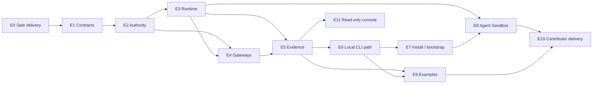

# MVP Epic Map

This document is the stable, repository-owned map of Agenova's MVP delivery areas. It explains what each Epic owns without duplicating mutable ticket details.

- Product scope and architecture are authoritative in this repository.
- Ticket scope, owners, status, sequence, blockers, and evidence are authoritative in [GitHub Issues](https://github.com/wunderforge/agenova/issues) and the [Agenova MVP Delivery project](https://github.com/users/wunderforge/projects/2).
- Do not maintain a second detailed ticket backlog in the repository.

## Priority

- **P0 — Core governance path:** required to prove a backend-neutral governed assignment.
- **P1 — Credible delivery:** required to install, demonstrate, understand, or contribute to the MVP.
- **Stretch:** useful after the committed path is reproducible; it cannot block the MVP.

## Epics

| Epic | Priority | Core responsibility |
| --- | --- | --- |
| [E0 — Delivery Safety and Integration Harness](https://github.com/wunderforge/agenova/issues/4) | P0 | Give contributors one reproducible PR baseline, task contract, quality-gate vocabulary, and evidence convention. |
| [E1 — Minimal Product Contract Kernel](https://github.com/wunderforge/agenova/issues/5) | P0 | Define the backend-neutral vocabulary for principal, AgentTemplate, ClaimRequest, SandboxClaim, authority, decision, and evidence. |
| [E2 — Authority Resolution and Claim Issuance](https://github.com/wunderforge/agenova/issues/6) | P0 | Authorize the caller and derive a claim whose effective authority cannot exceed applicable limits. |
| [E3 — Governed Run and RuntimeBackend v0](https://github.com/wunderforge/agenova/issues/7) | P0 | Run an issued claim through a backend-neutral lifecycle and end governed authority on every terminal path. |
| [E4 — Tool and Model Gateway Enforcement](https://github.com/wunderforge/agenova/issues/8) | P0 | Enforce claim-scoped Tool and Model access while keeping provider credentials outside the worker. |
| [E5 — Claim Facts and Evidence View](https://github.com/wunderforge/agenova/issues/9) | P0 | Produce one deterministic account of authorization, authority, behavior, outcome, lineage, and backend placement. |
| [E6 — CLI and Local Golden Workflow](https://github.com/wunderforge/agenova/issues/10) | P0 | Let a teammate submit canonical YAML and reproduce the complete local governance path without editing code. |
| [E7 — Reference Installation and Initial Policy Bootstrap](https://github.com/wunderforge/agenova/issues/11) | P1 | Install Agenova on an existing test cluster and seed the initial policy without confusing bootstrap RBAC with Agenova authorization. |
| [E8 — Kubernetes Agent Sandbox MVP Adapter](https://github.com/wunderforge/agenova/issues/12) | P1 | Prove the supported RuntimeBackend semantics on Kubernetes Agent Sandbox without changing the application-facing contract. |
| [E9 — Example Agents, Lineage, and Adversarial Cases](https://github.com/wunderforge/agenova/issues/13) | P1 | Teach the contract through reproducible engineer/reviewer agents and one bounded denial demonstration. |
| [E10 — Contributor Delivery](https://github.com/wunderforge/agenova/issues/14) | P1 | Let a new contributor understand the boundary, select a ticket, pass the right gates, and reproduce the demo without private guidance. |
| [E11 — Read-only Claim Console and Optional Trace Correlation](https://github.com/wunderforge/agenova/issues/15) | P1 | Show live request/claim evidence through a read-only API and React console; trace correlation remains stretch. |

## Delivery Waves

| Wave | Outcome | Epics |
| --- | --- | --- |
| 0 — Safe integration | Team changes receive deterministic back-pressure | E0 |
| A — Authority spine | A trusted request becomes a bounded, system-issued claim | E1–E3 |
| B — Governed execution | Access is enforced, recorded, queryable, and reproducible locally | E4–E6 |
| C — Credible delivery | The product installs on a test cluster and proves one real backend | E7–E8 |
| D — Understandable delivery | Examples, contributor material, and a console explain the same contract | E9–E11 |

Work may overlap after the relevant contract and fixtures are accepted. A later Epic must not force Kubernetes-, provider-, agent-, or UI-specific concepts back into the shared contract.

## Dependency Spine

The diagram shows product dependencies, not exclusive team ownership. Exact readiness is represented by native GitHub dependencies and project status.

## Scope Guardrails

These are not separate MVP product centers:

- identity-provider integration, user management, general policy CRUD, or delegated administration;
- Kubernetes cluster creation, production lifecycle management, HA, or multi-cluster operations;
- a workflow DAG engine or general multi-agent orchestrator;
- a second production backend or a competing sandbox controller;
- a standalone chaos lab, broad operations dashboard, or analytics platform.
