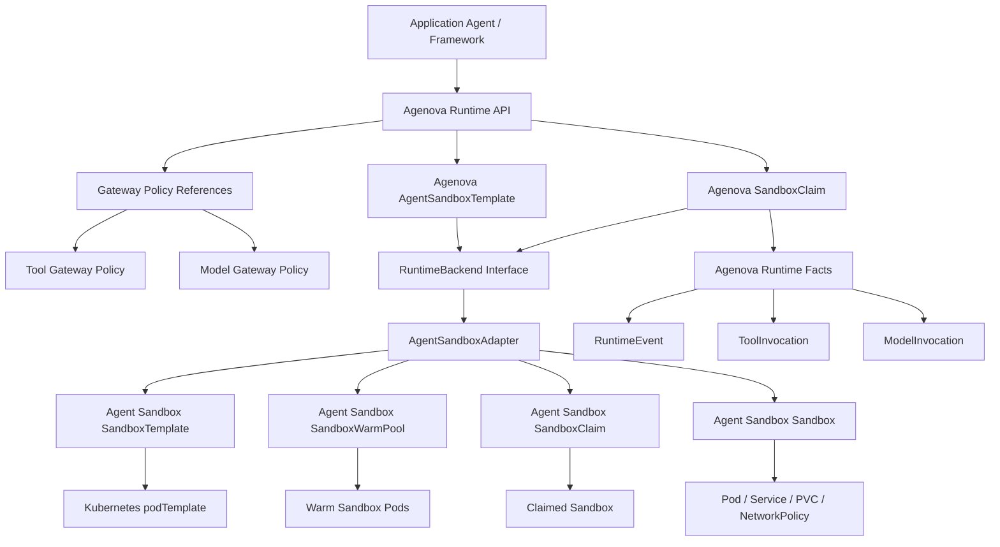
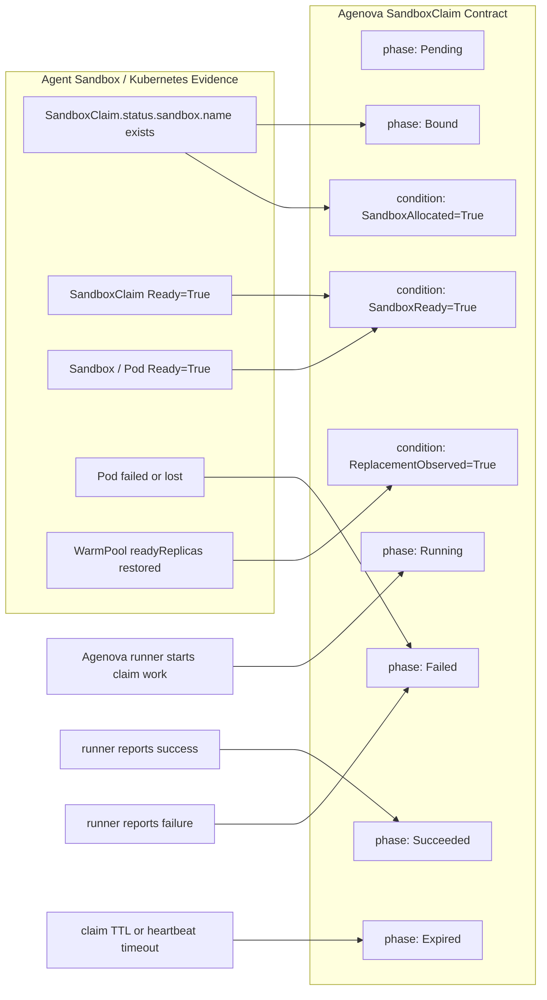

# Runtime Backend MVP Contract

This note records the MVP runtime-backend contract for the Agent Sandbox pivot. It is a design contract, not an implementation plan.

## Purpose

Agenova keeps its own runtime semantics above any backend-specific substrate.

Kubernetes SIG Apps Agent Sandbox may provide the first backend substrate, but Agenova product APIs must not depend directly on upstream Agent Sandbox CRDs or Kubernetes Pod details.

## MVP Position

For the MVP:

- A `SandboxClaim` is one agent worker run / sandbox execution lease.
- A `SandboxClaim` is not one tool call.
- Sandboxes do not receive external system credentials.
- Sandboxes do not directly access external systems.
- External tool access goes through the Tool Gateway.
- Model access goes through the Model Gateway.
- Gateway calls are authorization and audit boundaries.
- Agent Sandbox readiness is infrastructure evidence, not agent-work success.
- Warm pool replacement is capacity evidence, not a terminal claim result.
- Isolation tiers are future work, not an MVP contract.

## Layering



## Template Contract

`Agenova AgentSandboxTemplate` describes product-level runtime policy. It should not expose raw Kubernetes `podTemplate` fields as the product contract.

MVP template fields should stay close to Agenova semantics:

- runtime image;
- command, args, or runner entrypoint;
- resource requests and limits;
- workspace mode;
- secret policy;
- restart or failure policy;
- Tool Gateway policy reference;
- Model Gateway policy reference;
- identity mode;
- timeout or lease policy;
- labels and correlation metadata.

Backend-specific fields such as Kubernetes `NetworkPolicy`, `RuntimeClass`, node selectors, and raw Pod security knobs may be adapter outputs or backend configuration, but they are not MVP product-level template fields.

## Warm Pool Granularity

Warm pools are tied to backend runtime templates, not to an abstract pool of empty machines.

In an Agent Sandbox backend, a warm pool normally pre-creates sandboxes from one `SandboxTemplate`. That template includes an image, command or runner shape, resources, workspace settings, and backend safety controls. Therefore, if every agent requires a different image and every agent must have low startup latency, each of those images may require its own warm pool.

That is a real cost and capacity tradeoff:

```text
one image per agent + every agent hot
  -> many warm pools
  -> low latency
  -> higher steady-state cost
```

```text
one image per agent + cold start for low-frequency agents
  -> fewer warm pods
  -> higher first-run latency
  -> lower steady-state cost
```

For the MVP, Agenova should not imply that every agent automatically receives a dedicated warm pool.

The MVP policy is:

- warm pools are configured for selected runtime templates;
- high-frequency or latency-sensitive agents may use a warm pool;
- low-frequency or cold-start-tolerant agents may start from zero warm capacity;
- warm pool capacity is an operational choice, not a semantic requirement for every agent;
- `SandboxClaim` semantics must work for both warm and cold acquisition paths.

## Agent Image Strategy

The simplest MVP model is image-based:

```text
AgentSandboxTemplate
  -> runtime image
  -> backend SandboxTemplate
  -> warm or cold sandbox
```

This keeps execution reproducible and easy to reason about, but it can multiply warm pools when many agents use distinct images.

A future extension may separate runtime images from agent artifacts:

```text
shared runtime image
  + claim-time agent artifact
  + Tool Gateway policy reference
  + Model Gateway policy reference
```

An agent artifact could be a Git revision, signed archive, Python wheel, npm package, OCI artifact, or configuration bundle. The runner would fetch, verify, load, and execute that artifact inside the sandbox for a specific claim.

That future model can reduce warm pool fragmentation, but it adds supply-chain, dependency, bootstrap, caching, and failure-mode complexity. It is not an MVP contract.

The MVP should document the tradeoff explicitly rather than hide it:

| Strategy | Benefit | Cost |
|---|---|---|
| Per-agent image | Simple, reproducible, clear dependency boundary | More images and potentially more warm pools |
| Cold start for low-frequency agents | Lower steady-state cost | Higher startup latency |
| Shared runtime image plus agent artifact | Better warm pool reuse | More complex bootstrap, verification, dependency isolation, and failure handling |

## Networking Contract

The MVP sandbox network posture is deny-by-default for external egress.

Sandboxes may communicate with Agenova runtime endpoints required for claim execution, Tool Gateway, and Model Gateway. Direct access from sandbox code to external tools, model providers, cloud APIs, or arbitrary internet destinations is outside the MVP contract.

This means:

```text
agent code
  -> Tool Gateway / Model Gateway
  -> external system or model provider
```

not:

```text
agent code
  -> external system or model provider
```

The adapter may implement this posture through Kubernetes `NetworkPolicy`, service allowlists, DNS controls, or backend-specific equivalents.

## SandboxTemplate vs podTemplate

Agent Sandbox `SandboxTemplate` is an upstream CRD that describes how Agent Sandbox creates and manages a sandbox.

Kubernetes `podTemplate` is only one part of that substrate template. It describes the eventual Pod shape: containers, command, args, volumes, resources, security context, service account, and restart policy.

The layering is:

```text
Agenova AgentSandboxTemplate
  -> AgentSandboxAdapter
  -> Agent Sandbox SandboxTemplate
  -> Kubernetes podTemplate
  -> Pod
```

## Claim State Mapping

Agent Sandbox and Kubernetes provide infrastructure evidence. Agenova owns claim execution semantics.



## Claim Phases

`Bound`, `Running`, `Succeeded`, `Failed`, and `Expired` are phases of the Agenova `SandboxClaim`. They are not Kubernetes Pod phases and not upstream Agent Sandbox sandbox phases.

MVP claim phases:

```text
Pending
  -> Bound
  -> Expired

Bound
  -> Running
  -> Failed
  -> Expired

Running
  -> Succeeded
  -> Failed
  -> Expired

Succeeded / Failed / Expired
  -> terminal
```

Phase meanings:

- `Pending`: claim exists but has not acquired a sandbox.
- `Bound`: claim has acquired a concrete sandbox lease.
- `Running`: Agenova runner has started work for this claim.
- `Succeeded`: runner reported successful completion.
- `Failed`: runner, policy, or infrastructure produced a terminal failure.
- `Expired`: claim exceeded its queue, startup, lease, heartbeat, or run timeout.

Failure details should be represented as reasons, conditions, and runtime facts, not as many extra top-level phases.

Examples:

```text
phase: Failed
reason: InfraFailed
condition: SandboxReady=False
```

```text
phase: Failed
reason: PolicyDenied
condition: ToolGatewayDenied=True
```

```text
phase: Failed
reason: WorkloadFailed
condition: RunnerStarted=True
```

## Runner Lifecycle

The runner is an Agenova execution coordinator. It is not a Kubernetes node.

In a warm-pool model, Pod lifecycle and claim execution lifecycle are intentionally different:

```text
Pod Ready before claim
  -> sandbox is warm and available

SandboxClaim adopts sandbox
  -> Agenova claim is Bound

Runner receives this claim's work
  -> Agenova claim is Running

Runner reports completion
  -> Agenova claim is Succeeded or Failed
```

Kubernetes `Pod Running` means the sandbox infrastructure process is running. It does not necessarily mean a specific Agenova claim's agent work has started.

## Adapter Responsibilities

The `AgentSandboxAdapter` maps Agenova runtime semantics to Agent Sandbox substrate resources.

MVP responsibilities:

- translate `AgentSandboxTemplate` into Agent Sandbox `SandboxTemplate`;
- enforce no external credentials in sandbox templates;
- enforce deny-by-default external egress through backend controls;
- create and observe Agent Sandbox `SandboxWarmPool`;
- create and observe Agent Sandbox `SandboxClaim`;
- map upstream sandbox adoption to Agenova `Bound`;
- map upstream sandbox identity to Agenova `sandboxID`;
- map upstream readiness evidence to `SandboxReady` conditions;
- map warm pool replacement evidence to runtime conditions;
- keep execution phases under Agenova control;
- preserve Tool Gateway and Model Gateway as required external-access paths;
- emit or support append-only Agenova runtime facts.

## Open Questions

- What is the exact MVP shape of the runner?
- Does the runner live as the sandbox entrypoint, a sidecar, or a runtime service session?
- Which claim timeout types are required in MVP?
- Which upstream Agent Sandbox TTL or cleanup features can be reused safely?
- What is the minimal policy reference shape for Tool Gateway and Model Gateway?
- Which Kubernetes network controls are required to prove deny-by-default egress in local and EKS environments?
- Which agents or runtime templates deserve warm capacity by default?
- When, if ever, should Agenova introduce shared runtime images plus claim-time agent artifacts?
