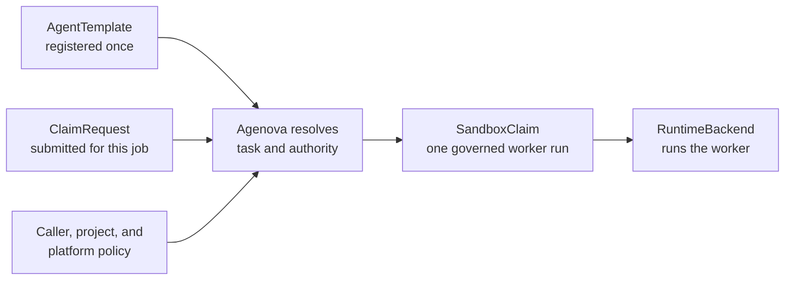
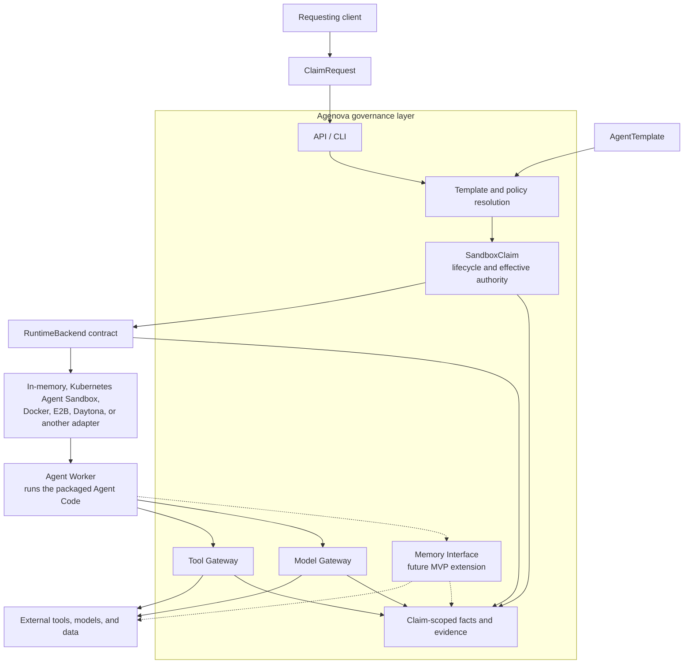
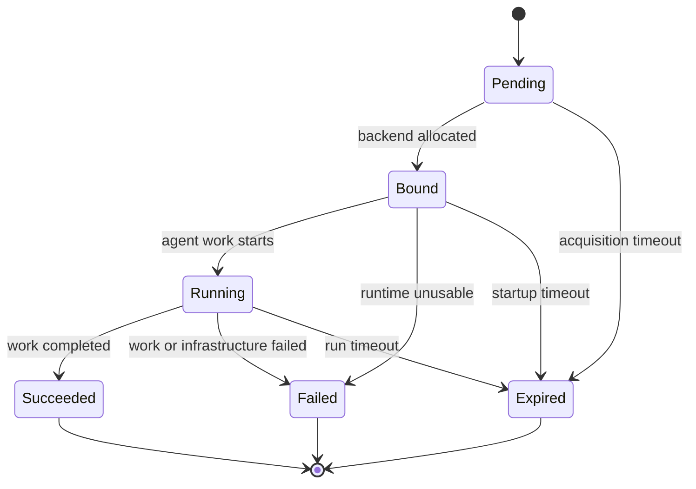

# Agenova Project Design

This document explains Agenova through one concrete agent job. No Kubernetes or platform-engineering knowledge is assumed.

> **Design status:** the YAML and CLI below show the intended product contract. Their final schemas are not frozen or implemented yet. See [Current project status](project-status.md) for what the repository proves today.

## 1. Start With a Familiar Agent Job

Imagine asking an `engineer` agent:

> Fix the payment timeout bug in `acme/payments`, run the tests, and open a pull request.

Here, `engineer agent` is shorthand for the reusable engineer role. Three more precise terms describe how that role becomes a running process:

- **Agent code** implements the model loop, interprets instructions and task input, and chooses tools.
- An **Agent Artifact/Image** is the runnable package built from that code and its dependencies.
- An **Agent Worker** is one running process started from that artifact for a specific task.

```text
Agent Code -> build -> Agent Artifact/Image
                          |
                    referenced by
                          v
AgentTemplate + ClaimRequest -> policy resolution -> SandboxClaim -> RuntimeBackend -> Agent Worker
```

The agent code decides how to investigate and fix the bug. Agenova does not replace that reasoning loop. It defines why this particular worker is running, what it may access temporarily, what happened, and which backend carried it.

## 2. The Missing Operating Boundary

Agent code can decide how to perform a task, but it does not automatically give a team consistent answers to these questions:

- Why does this worker exist, and which reusable role is it using?
- Who authorized it, and which resources may it access temporarily?
- How can it use GitHub or a model without receiving a long-lived provider credential?
- Which tool, model, and memory calls were allowed or denied?
- What was the outcome, and where did the worker run?

Agenova's answer is a **claim-scoped governance contract**: a stable, auditable boundary around one worker assignment. Kubernetes, Agent Sandbox, Docker, E2B, Daytona, or another provider may run the process; Agenova keeps the assignment's meaning consistent across them.

## 3. Separate the Reusable Role From Today's Job

Some information should stay consistent across every engineer run; other information changes for each assignment.

| Stays reusable | Changes for each job |
| --- | --- |
| Role and instructions | Objective and input data |
| Agent Artifact/Image and entrypoint | Repository or other target resources |
| Default model, memory, and runtime settings | Requested tool, model, and memory access |
| Maximum capabilities this role may receive | Timeout and other run-specific requirements |

Agenova represents the reusable side as an `AgentTemplate` and the per-job side as a `ClaimRequest`.

One consistent analogy is:

| Term | Analogy | What it means |
| --- | --- | --- |
| Agent Artifact/Image | Sealed software package | The executable agent code and dependencies |
| `AgentTemplate` | Approved role profile | The role, artifact reference, defaults, and capability ceiling |
| `ClaimRequest` | Work order | What this run should do and which access it requests |
| `SandboxClaim` | Issued assignment record | The run's effective authority, state, backend identity, and evidence |
| `RuntimeBackend` | Workspace provider | The system that actually runs the worker process |
| Tool/Model Gateways and Memory Interface | Controlled access points | Where external access is checked, performed, and recorded |

The Artifact/Image is therefore only one part of an Agent Template. The template references that runnable package and adds the reusable role, defaults, and governance limits. It may also reference versioned instructions, but the agent code—not Agenova—interprets them and performs the reasoning loop.

## 4. Target Experience: Template Plus Request

### Register the reusable agent role

The team defines an `engineer` template once and reuses it for many jobs:

```yaml
apiVersion: agenova.io/v1alpha1
kind: AgentTemplate
metadata:
  name: engineer
spec:
  role:
    description: Change code, run tests, and prepare pull requests
    instructionsRef: agent-instructions/engineer-v1

  artifact:
    image: ghcr.io/acme/coding-agent:v1
    command: ["/app/run"]

  defaults:
    modelProfile: approved-coding-model
    memoryScopes: [team-docs]
    runtimeProfileRef: standard-isolated

  capabilityCeiling:
    tools: [git.read, git.write, github.pull-request]
    resourceTypes: [repository]
    modelProfiles: [approved-coding-model]
    memoryScopes: [team-docs]
```

This template carries references and limits, not live credentials. A template is long-lived, but it has no authority to access GitHub or another external system by itself.

### Submit one job

For the payment bug, the user submits a `ClaimRequest` that references the template instead of repeating the image, entrypoint, instructions, and limits:

```yaml
apiVersion: agenova.io/v1alpha1
kind: ClaimRequest
metadata:
  name: fix-payment-timeout
spec:
  templateRef: engineer
  task:
    type: repository-change
    input:
      repository: acme/payments
      objective: Fix the payment timeout bug
      baseBranch: main

  requestedAccess:
    tools: [git.read, git.write, github.pull-request]
    resourceScopes: [repo:acme/payments]
    modelProfile: approved-coding-model
    memoryScopes: [team-docs]

  runtime:
    profileRef: standard-isolated
    timeout: 20m
```

The target CLI submits that same request schema:

```text
agenova run -f tasks/fix-payment-timeout.yaml
```

YAML is only one representation of these Agenova contracts. The same objects may be submitted as API JSON, and they do not have to be Kubernetes resources.

The MVP also targets a separate `agenova install -f <installation.yaml>` operator path for an existing test cluster. Sharing one executable does not make the two commands equally privileged: `run` is an untrusted task-submission client, while `install` relies on the operator's existing Kubernetes identity and RBAC. The installation file may seed Agenova's first policy for later actions, but it cannot authorize its own bootstrap operation or contain cluster credentials.

### Resolve the request into a run

The request asks for access; it does not grant access. Agenova checks the request against the template and applicable policies before it creates the system-managed claim.



If the request asks for `production.deploy` but the template or policy does not allow it, the claim does not receive it. A request can narrow authority; it cannot create authority.

## 5. How One Run Works

1. A requesting client—such as a user through the CLI or an upstream system—submits a `ClaimRequest`.
2. Agenova validates the task, resolves the `AgentTemplate`, and derives effective authority.
3. Agenova creates one `SandboxClaim` for the worker run.
4. A `RuntimeBackend` allocates the execution environment and starts an Agent Worker from the template's Artifact/Image.
5. The worker uses Tool/Model Gateways and the future Memory Interface with its claim-scoped identity.
6. These controlled interfaces enforce authority, keep provider credentials outside the worker, and record facts.
7. Agenova records the outcome and backend evidence; terminal claims can no longer use governed access.

The working name `SandboxClaim` does not make Kubernetes the product boundary. It is Agenova's backend-neutral record for one worker assignment; its final public name remains an open product decision.

## 6. Architecture and Ownership



| Layer | Owns | Does not own |
| --- | --- | --- |
| Requesting client | Template selection, task input, and requested access | Granting itself authority or controlling backend internals |
| Agent code/framework | Reasoning loop, prompts, instruction and task interpretation, and tool choice | Runtime governance and isolation evidence |
| Agenova | Request resolution, claim lifecycle, effective authority, gateways, facts, lineage, and backend-neutral contracts | How the agent reasons or plans |
| Runtime backend | Process execution, placement, sandbox lifecycle, and substrate isolation capabilities | Agenova's application-facing claim semantics |

## 7. Authority, Credentials, and Evidence

Effective authority is the intersection of all applicable limits:

```text
template capability ceiling
  intersect requested access
  intersect caller, project, and platform policy
  intersect runtime restrictions
  = effective claim authority
```

The request contains names, scopes, and profile references, never provider secret values. The intended external-access path is:

```text
agent worker -> Agenova Gateway -> external system
```

not:

```text
agent worker -> long-lived provider secret -> external system
```

The Gateway checks the active claim, performs an allowed call with gateway-held credentials, and records the result. Network controls and workload identity must also prevent the worker from bypassing the Gateway. A Gateway unit test alone is not proof of production isolation.

Facts below the claim include lifecycle events, tool invocations, model invocations, denials, outcome, and backend evidence. One claim represents the whole worker run; individual tool or model calls are facts under it, not separate claims.

## 8. Claim Lifecycle



Backend readiness is not work success. A process or Pod may be ready while the claim is only `Bound`; the claim becomes `Running` when Agenova starts the agent work. Cleanup is backend evidence and does not replace the worker's `Succeeded`, `Failed`, or `Expired` outcome.

## 9. Replaceable Runtime Backends

`RuntimeBackend` is the adapter boundary between Agenova governance and process execution. An adapter must map allocation, readiness, execution, termination, cleanup, and backend evidence without leaking provider-specific types into the shared application contract.

- The **in-memory backend** is fast and deterministic. It is the reference oracle for contract tests, but it provides no real isolation.
- The **Kubernetes Agent Sandbox adapter** is the current real-backend candidate and existing spike.
- **Docker, E2B, Daytona, ECS/Fargate, or another provider** can be added when an adapter preserves the same claim meaning.

Agenova should consume sandbox lifecycle, warm pools, snapshots, placement, and isolation from capable backends rather than rebuild those systems.

## 10. MVP and Future Extension

The shared MVP should prove one coherent path:

```text
register one AgentTemplate
  -> submit one ClaimRequest
  -> derive effective authority and create the claim
  -> run through the reference backend
  -> allow and deny governed calls
  -> query facts, outcome, and backend evidence
  -> show authority ending with the claim
  -> repeat the supported runtime slice on one real backend
```

The primary product surfaces are a usable CLI and a live read-only claim console. The console obtains the same backend-neutral evidence representation through a minimal API; it does not define a UI-specific claim or policy model and does not provide mutation controls. A later engineer/reviewer example may add a child claim with authority constrained by its parent; this demonstrates multi-agent accountability, not workflow DAG scheduling.

### What exists today

The repository already proves reference claim lifecycle, an in-memory backend contract, in-process Tool and Model authorization, claim-scoped facts, and parent/child scope. It also contains a Kubernetes Agent Sandbox adapter spike.

The target `AgentTemplate`/`ClaimRequest` schemas, resolver, usable CLI, networked gateways, durable storage, Memory Interface, and UI are not implemented. [Current project status](project-status.md) is the detailed source of truth.

### Non-goals

Agenova is not:

- an agent framework or agent builder;
- a prompt or workflow DAG orchestration system;
- Kubernetes for agents;
- a replacement for sandbox/runtime providers;
- a claim of hostile-agent isolation without runtime and network evidence.
